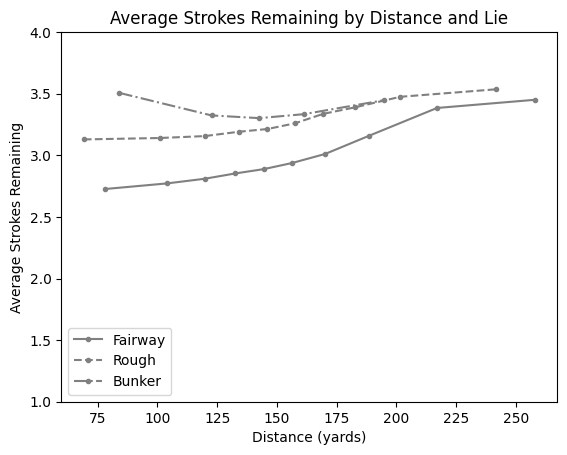

# approach
Modeling expected strokes as a function of distance from the hole and lie type

## Data Exploration

The following figure shows separate the average strokes gained by distance quantiles by lie type (fairway, rough, and bunker)

Several patterns jump out from the above:

*   At shorter distances, a shot from the fairway offers about a half stroke advantage over shots from the rough and almost a full stroke advantage from bunker shots
*   That gap narrows between lie types as distance from the hole increases
*   Bunker shots from shorter distances appear to be the most difficult shot type. Perhaps, at intermediate distances on approach, bunker shots are more difficult to control. The difficulty of bunker shots and shots from the rough converge at around 150 yards from the hole
